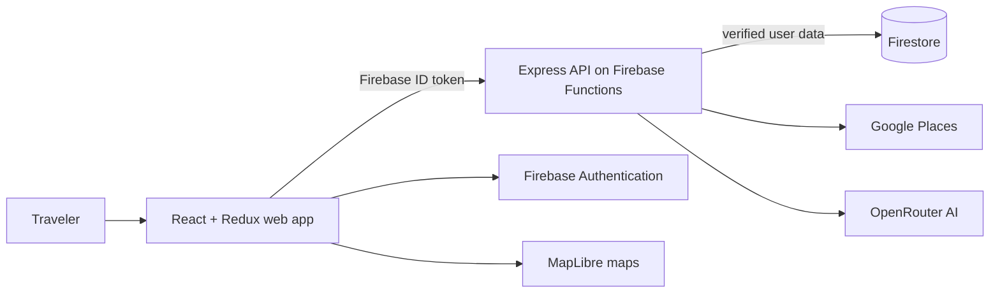

# VoxTrail

> A context-aware travel companion for translating, discovering, planning, and staying prepared.

VoxTrail brings the tools travelers usually spread across several apps into one workspace. Set a destination and language pair once, then use that context across translation, phrasebooks, stays, places, cultural guidance, itineraries, and emergency utilities.

## Features

- **Translation workspace** — Text translation with optional speech input, playback, and save actions.
- **AI phrasebooks** — Generate useful phrases for airports, dining, directions, emergencies, and more.
- **Saved phrases** — Keep a personal, Firestore-backed collection of favorites.
- **Stays search** — Find accommodations with ratings, amenities, photos, filters, and map context.
- **Discover** — Explore destinations and points of interest with rich detail pages and maps.
- **Itinerary planner** — Build context-aware itineraries from destinations, interests, pace, and budget.
- **Cultural guidance** — Learn local etiquette and get destination-aware travel tips.
- **Emergency utilities** — Quickly find local emergency numbers and safety guidance.
- **Responsive experience** — Polished light/dark themes, mobile navigation, and offline-friendly saved content.

## Architecture



```text
VoxTrail
├── travel-app-fe/              React + Vite + Material UI frontend
├── travel-app-be/              Express API + Firebase Admin backend
├── travel-app-be/functions/    Firebase Functions entry points
└── scripts/                    Deployment and release helpers
```

### Technology

| Layer | Stack |
| --- | --- |
| Frontend | React 18, Vite, React Router, Redux Toolkit, Material UI, MapLibre |
| Backend | Node.js, Express, Firebase Admin, Firestore, Zod |
| Services | Firebase Auth, Google Places, OpenRouter, Xenova Transformers |
| Delivery | Firebase Hosting, Firebase Functions, GitHub Actions |

## Run locally

### 1. Install dependencies

```bash
cd travel-app-fe && npm ci
cd ../travel-app-be && npm ci
```

### 2. Configure environment

```bash
cp travel-app-fe/.env.example travel-app-fe/.env
cp travel-app-be/.env.example travel-app-be/.env
```

Configure the Firebase values, `VITE_API_URL`, backend `FB_ADMIN_CREDENTIALS`, `REQUEST_SIGNING_SECRET`, and provider keys for Google Places and OpenRouter. Never commit `.env` files, API keys, service-account JSON, or other secrets.

### 3. Start both apps with one command

From the repository root on macOS/Linux:

```bash
(cd travel-app-be && npm run dev) & (cd travel-app-fe && npm run dev) & wait
```

Open the frontend at [http://localhost:5173](http://localhost:5173). The API runs at [http://localhost:8000](http://localhost:8000).

Or use two terminals:

```bash
# Terminal 1
cd travel-app-be && npm run dev

# Terminal 2
cd travel-app-fe && npm run dev
```

## Useful commands

```bash
# Frontend
cd travel-app-fe
npm run dev
npm run build
npm test

# Backend
cd travel-app-be
npm run dev
npm start
npm test
```

Health checks:

```bash
curl http://localhost:8000/healthz
curl http://localhost:8000/readyz
```

## API overview

```text
POST   /api/translate
POST   /api/phrasebook/generate
GET    /api/saved-phrases
POST   /api/saved-phrases
DELETE /api/saved-phrases/:id
GET    /api/stays/search
GET    /api/stays/:id
GET    /api/poi/search
GET    /api/poi/:id
GET    /api/culture/brief
POST   /api/culture/qa
POST   /api/culture/contextual
POST   /api/itinerary/generate
```

See [API_Documentation.md](API_Documentation.md) for request and response details.

## Deploy

The repository includes a Firebase helper that builds the frontend, syncs it into the hosting directory, and deploys Hosting plus the backend Functions codebase:

```bash
./scripts/firebase-deploy.sh --project YOUR_FIREBASE_PROJECT_ID
```

You need the Firebase CLI, an authenticated Firebase account, configured production secrets, and verified Firestore rules/indexes.

GitHub Actions workflows are available in `.github/workflows/`:

- `ci.yml` runs frontend tests/build, backend tests, Functions lint, and dependency audits.
- `deploy.yml` deploys from `main` when every required Firebase repository secret is configured;
  otherwise its preflight reports a clean skip instead of claiming a deployment occurred.

## Security

VoxTrail includes Firebase token verification, role-aware access control, request validation, CORS allowlisting, Helmet headers, request IDs, HMAC validation for unsigned sensitive requests, endpoint throttles, and durable production quotas for AI generation.

Review [ENVIRONMENT_VARIABLES.md](ENVIRONMENT_VARIABLES.md) and [travel-app-be/firestore.rules](travel-app-be/firestore.rules) before production configuration.

## Production status

The project is actively hardening toward production. The current readiness assessment is **conditional NO-GO for unrestricted public launch** while the full frontend suite, backend CI execution, dependency audit, provider quotas, staging observability, and legal-policy verification are completed.

Read the full assessment in [PRODUCTION_READINESS_REPORT.md](PRODUCTION_READINESS_REPORT.md).

## Documentation

- [API documentation](API_Documentation.md)
- [Environment variables](ENVIRONMENT_VARIABLES.md)
- [Production deployment guide](travel-app-be/PRODUCTION_DEPLOYMENT.md)
- [Monitoring and logging guide](MONITORING_LOGGING.md)

## Contributing

1. Create a focused feature branch.
2. Keep changes scoped and document API or environment changes.
3. Run the frontend build/tests and backend tests before opening a pull request.
4. Never commit secrets or generated deployment artifacts.

## License

This project is released under the MIT License. See [LICENSE](LICENSE).
